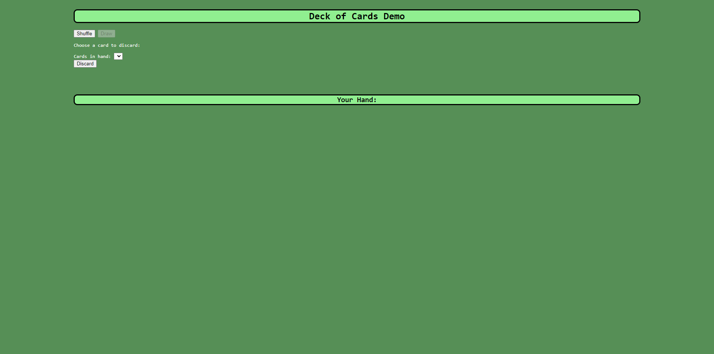

# Deck of Cards Demo

## Description

After initially creating this project in codepen.io, I wanted to be able to add to this project with my newfound knowledge and skills that I've recently acquired. With this project, I can set up basic functionality for future card game projects including shuffling, drawing, and discarding cards.

## Installation

You can access this page with the following URL: https://jmcmillenmusic.github.io/deck-of-cards-demo/

## Usage

Click on the Shuffle button first to shuffle the deck. Then, click on the Draw button to draw a card. You'll see all of the cards you've drawn so far in the "Your Hand" section. To discard a card, choose a card from the dropdown menu and click on the Discard button. The image of the card you discarded goes away.

## Credits

N/A

## License

This project uses the MIT License.